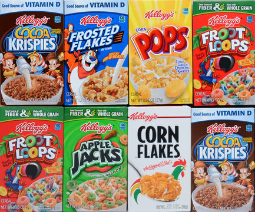
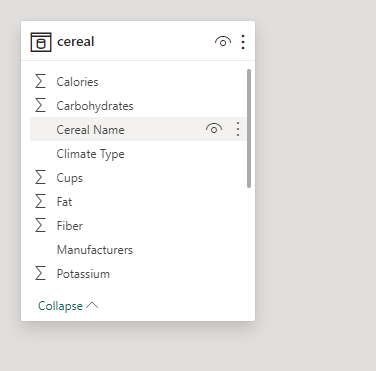
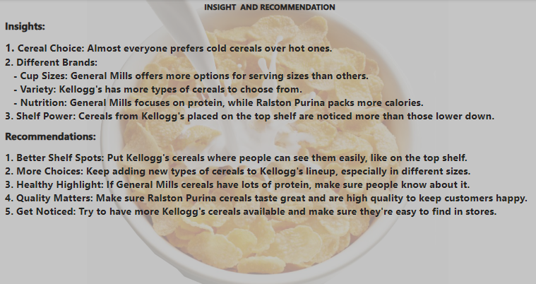

## CEREALS ANALYSIS

 |  
                                          
## Introduction: 
This Power BI project delves into the analysis of 80 different cereals, offering valuable insights into various aspects such as manufacturers, consumer preferences, and nutritional content including calories, vitamins, protein, and sugar levels.

## Content:
### The dataset contains the following fields:
-	Name: Name of cereal
-	mfr: Manufacturer of cereal
- A = American Home Food Products;
- G = General Mills
- K = Kelloggs
- N = Nabisco
- P = Post
- Q = Quaker Oats
- R = Ralston Purina
  #### type:
-	cold
-	hot
- calories: calories per serving
-	protein: grams of protein
-	fat: grams of fat
-	sodium: milligrams of sodium
-	fiber: grams of dietary fiber
-	carbo: grams of complex carbohydrates
-	sugars: grams of sugars
-	potass: milligrams of potassium
-	vitamins: vitamins and minerals - 0, 25, or 100, indicating the typical percentage of FDA recommended
-	shelf: display shelf (1, 2, or 3, counting from the floor)
- weight: weight in ounces of one serving
-	cups: number of cups in one serving
-	rating: a rating of the cereals (Possibly from Consumer Reports?)

## Problem statement:
1.	what manufacturers has the highest protein?
2.	What manufactures has the highest calories?
3.	Which manufacturer has the highest count?
4.	What is the cereals preference of the consumers?
5.	Which shelf has the highest number of cereals?

## Modelling
There is only one single table.

## Visualization:
This report comprises 2 pages:

1. Main Dashboard

2. Insight

You can interact with the report [here](https://app.powerbi.com/view?r=eyJrIjoiYjM5YTg2MDYtOGNjOS00YzAxLTg2MzUtNWEzOThiYWQ5Yzg0IiwidCI6ImRmODY3OWNkLWE4MGUtNDVkOC05OWFjLWM4M2VkN2ZmOTVhMCJ9)

## Analysis :

### Main Dashboard

At 19.25, General Mills had the highest Sum of Cups and was 1,825.00% higher than American Home Food Products, which had the lowest Sum of Cups at 1.

General Mills accounted for 30.45% of Sum of Cups.
 
Across all 6 Manufacturers, Max of Protein ranged from 4 to 6.

### Insights and Recommendation

### Insights
Insights:

1. Cereal Choice: Almost everyone prefers cold cereals over hot ones.

2. Different Brands:

   - Cup Sizes: General Mills offers more options for serving sizes than others.

   - Variety: Kellogg's has more types of cereals to choose from.

   - Nutrition: General Mills focuses on protein, while Ralston Purina packs more calories.

3. Shelf Power: Cereals from Kellogg's placed on the top shelf are noticed more than those lower down.

### Recommendations:
1. Better Shelf Spots: Put Kellogg's cereals where people can see them easily, like on the top shelf.

2. More Choices: Keep adding new types of cereals to Kellogg's lineup, especially in different sizes.

3. Healthy Highlight: If General Mills cereals have lots of protein, make sure people know about it.

4. Quality Matters: Make sure Ralston Purina cereals taste great and are high quality to keep customers happy.

5. Get Noticed: Try to have more Kellogg's cereals available and make sure they're easy to find in stores.

